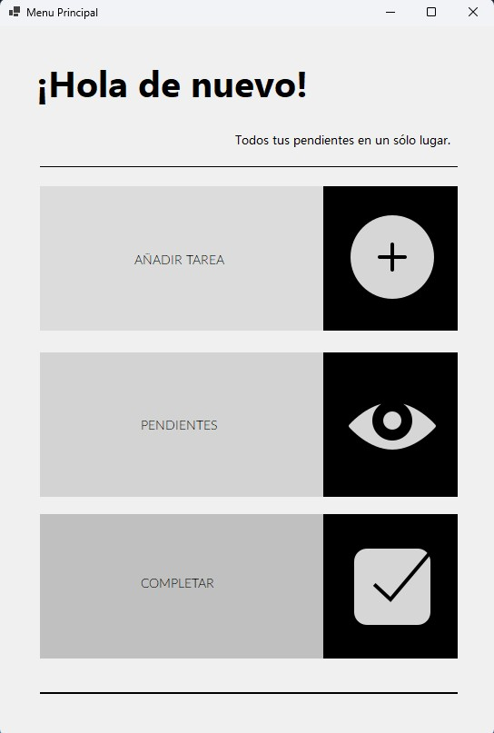
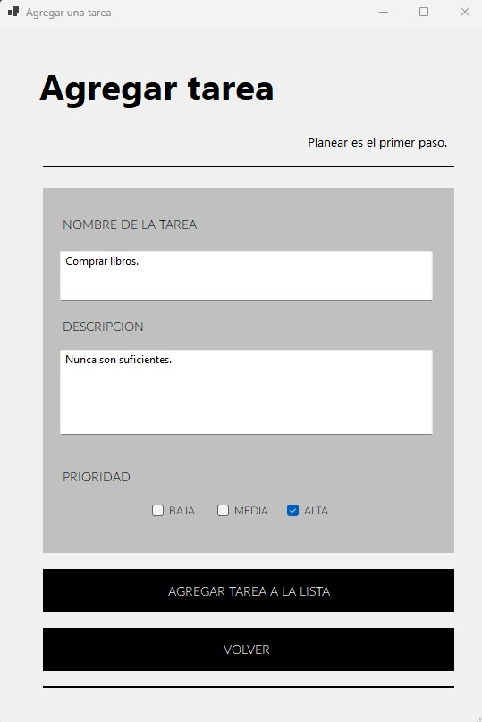
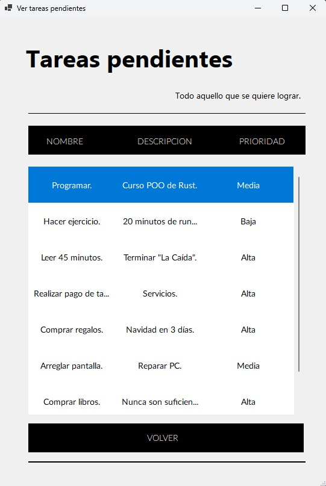
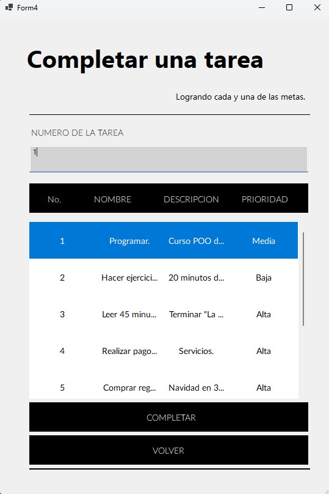

# Sitema de gestión de tareas pendientes. - To Do List minimalista.

Este proyecto es parte de mi transición entre Java y C# y viceversa claro.
El principal objetivo era desarrollar un pequeño proyecto que usara las bondades de C# en Visual Studio Community y su diseñador, además de poder
utilizar un gestor de bases de datos embebido dentro del proyecto como lo es SQLite y así no depender de servicio externos al programa principal.

Practicar y probar por mi mismo estar tecnologías fue igualmente la meta al momento de desarrollar este sistema.

La solución tiene integrada una interfaz de usuario, creo yo, relativamente minimalista que parte de la versión en consola previamente desarrollada. 

## Características
- Menu de selección para poder navegar entre las funciones del sistema.
- Posibilidad de agregar tareas; nombre de la tarea, descripción y su prioridad.
- Modulo para poder visualizar todas las tareas previamente agregadas.
- Gestión de las tareas por medio de la finalización de las mismas.

## Tecnologías utilizadas
- **Lenguaje de programación:** C#
- **Framework para la interfaz gráfica:** WinForms, Visual Studio Community 2022
- **Base de datos:** SQLite

## Cómo usar

El proyecto está realizado para poder correr sin tener un gestor de base de datos. (Se crea la BD dentrp del proyecto al correrlo).

1. Clona este repositorio.
2. Las dependencias vienen ya precargadas en la  carpeta "Dependencias"
3. Puede que sea necesarios instalar mediante NuGet: System.Data.SQLite.Core
4. Abrir la solución con VS Community 2022.
8. Ejecuta `ClasePrincipal.cs` para iniciar la aplicación.

## Capturas de pantalla

### Pantalla de inicio del programa

### Agregar una tarea

### Poder ver las tareas pendientes

### Poder completar una tarea

